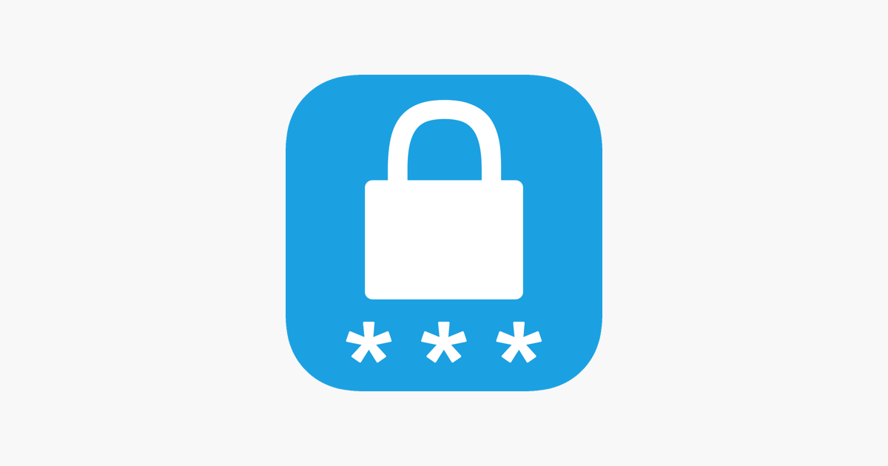

# Генератор паролей

Программа, которая генерирует случайные пароли на основе заданных пользователем параметров. 

Программа позволяет пользователю задавать длину пароля и выбирать, какие символы использовать для генерации:

- Заглавные буквы (A-Z)
- Строчные буквы (a-z)
- Цифры (0-9)
- Специальные символы (!@#$%^&*)
